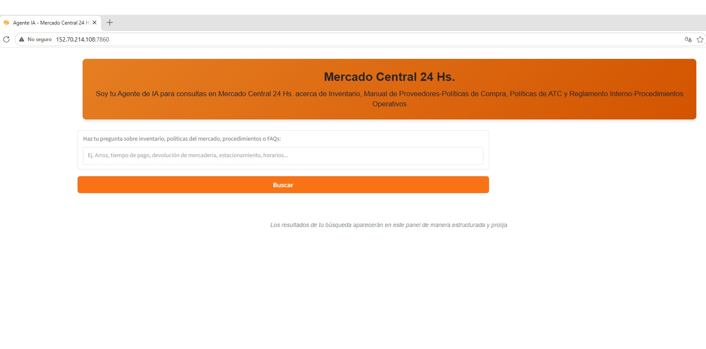
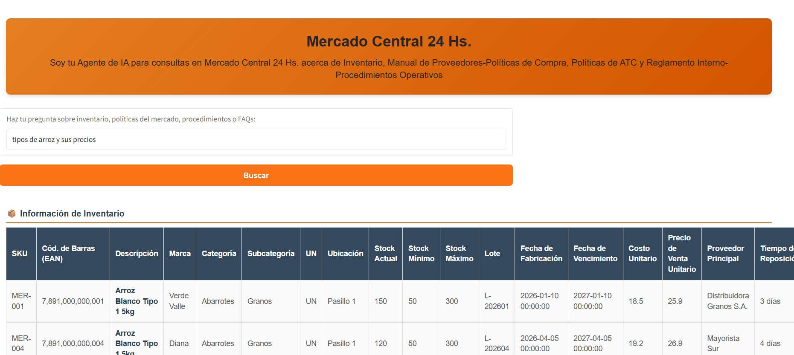

# Agente de IA - Mercado Central 24 Hs 🚀

Este proyecto es un **agente conversacional inteligente** diseñado para resolver de forma autónoma y semántica consultas de inventario, políticas de compra de proveedores, atención al cliente (ATC) y reglamentos internos para **Mercado Central 24 Hs**.

La aplicación cuenta con una interfaz web interactiva y amigable montada sobre **Gradio**, y un motor híbrido de recuperación de información basado en procesamiento de lenguaje natural (NLP) semántico y consultas estructuadas de base de datos.

## 📸 Demostración (Aplicación en Funcionamiento)

Aquí puedes visualizar el agente de IA interactuando y procesando solicitudes en tiempo real:

| Interfaz de Usuario (Gradio) | Resultados de Búsqueda Semántica | 
| ----- | ----- | 
|  |  | 

## 🛠️ Características Principales

* **Búsqueda Semántica Híbrida:** Utiliza el modelo de embeddings local `all-MiniLM-L6-v2` para mapear de manera conceptual las intenciones de los usuarios y contrastarlas contra los manuales corporativos en PDF.

* **Hermeticidad y Control de Contexto:** Algoritmos avanzados de *boosting* evitan cruces de información incorrectos (por ejemplo, previniendo falsos positivos entre las preguntas de estacionamiento del FAQ y el stock del inventario).

* **Base de Datos Dinámica:** Integración fluida con planillas de Excel (`Inventario.xlsx`) para reportar precios en guaraníes (Gs.), stock en tiempo real y ubicaciones de góndola de manera exacta.

* **Interfaz de Selección Múltiple:** Si el usuario realiza una búsqueda ambigua, el sistema despliega un panel interactivo de radio-botones para que el usuario precise el artículo de su interés.

## ☁️ Infraestructura y Despliegue (Producción 24/7)

La aplicación se encuentra actualmente desplegada y disponible para el público las 24 horas del día gracias a la siguiente arquitectura de infraestructura:

* **Servidor en la Nube:** Instancia de Cómputo en **Oracle Cloud Infrastructure (OCI)** dentro de la capa gratuita permanente (Always Free).

* **Arquitectura de Procesador:** Ampere ARM (A1 Flex) optimizado para cargas de trabajo eficientes de IA y NLP.

* **Resiliencia de Servicio (Systemd):** Configurada como un servicio nativo del sistema operativo Ubuntu (`agente_mercado.service`). Si el servidor se reinicia o el proceso experimenta un fallo fortuito, el sistema lo levanta automáticamente en menos de 5 segundos.

* **Seguridad y Cortafuegos:** Reglas de red estructuradas mediante tablas de enrutamiento IP (`iptables`) y cortafuegos de Ubuntu (`UFW`) para blindar el acceso y habilitar de manera segura el puerto `7860`.

## 🗂️ Estructura del Repositorio

La prolijidad del proyecto se refleja en la organización limpia de sus directorios:

```
agente-mercado-central/
├── app.py                  # Código fuente principal de la aplicación Gradio
├── requirements.txt        # Librerías y dependencias (optimizado para CPU)
├── .gitignore              # Filtro de archivos excluidos (llaves, entornos virtuales)
├── readme.md               # Documentación y presentación del proyecto (este archivo)
├── datos/                  # Base de conocimiento real del negocio
│   ├── Inventario.xlsx     # Planilla física de stock y precios
│   ├── FAQ.pdf             # Preguntas frecuentes de clientes
│   ├── Politica de ATC.pdf # Lineamientos de Atención al Cliente
│   └── ...                 # Manuales corporativos de compras y operaciones
└── img/                    # Capturas de pantalla para la documentación
├── screenshot_panel.jpg
└── screenshot_respuesta.jpg
```

## 📜 Historial de Evolución (Control de Versiones)

Una de las mayores fortalezas técnicas de este repositorio es su **historial cronológico de desarrollo**. El código base fue madurando a lo largo de **27 iteraciones evolutivas**, preservadas fielmente en la bitácora de Git.